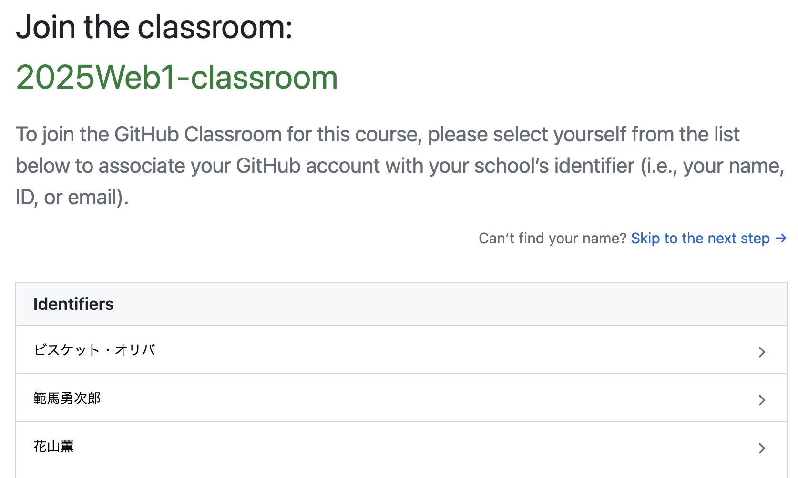
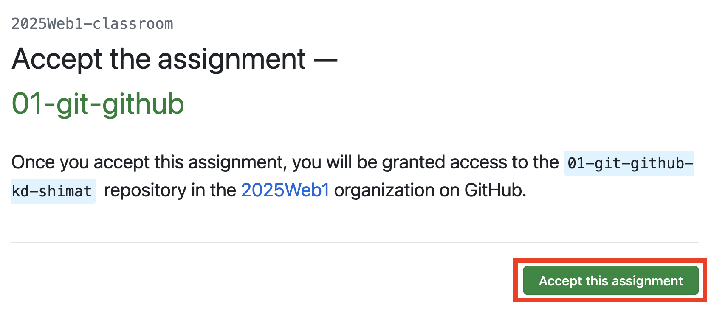
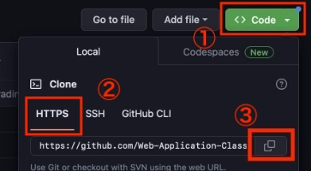
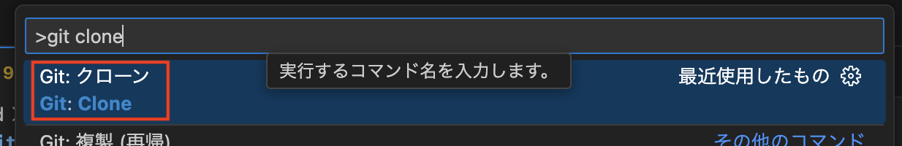
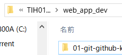

# GitHub Classroom①

本授業では **GitHub Classroom** を利用してコードの取得や課題提出をします。
GitHub Classroomは、GitHubを利用した課題管理ツールで、課題の提出や採点を効率的に行うことができるサービスです。

## GitHub Classroomからコードを取得(clone)

{: style="width: 660px;height: auto;" }

GitHub Classroomからコードを取得します。
今後も章が進むたびに、この手順を繰り返すので、慣れるようにしましょう。

1. 本授業のコード保管用フォルダ`¥web_app_dev`を、Cドライブ直下に作成
2. [こちらのリンク](https://classroom.github.com/a/bPW2aS9n)にアクセス<br>
   ※ログインを求められた場合は、GitHubアカウントでログインしてください。
3. 自分の名前を選んでクリック<br>
{: style="width: 660px;height: auto;" }<br><br>
4. `Accept this assignment`をクリック<br>
{: style="width: 660px;height: auto;" }<br><br>
5. コード取得用のリンクをクリック<br>
   ※リンクが表示されない場合は、ブラウザをリロードしてください。<br>
{: style="width: 660px;height: auto;" }<br><br>
6. 「①緑色のボタン(<>Code)」 → 「②HTTPSタブ」 → 「③コピー用ボタン」をクリックし、clone用URLをコピー<br>
{: style="width: 660px;height: auto;" }<br><br>
7. `Ctrl+Shift+P`でVSCodeのコマンドパレットを出し、`git clone`と入力後、「Git: クローン」をクリック<br>
   {: style="width: 660px;height: auto;" }<br><br>
8. 先ほどコピーしたリポジトリのURLを貼り付けEnter<br>
{: style="width: 660px;height: auto;" }<br><br>
9.  フォルダの選択画面になるので、Cドライブ直下の`web_app_dev` フォルダを選択
10.  認証を求められるので、ブラウザでアカウントを入れて認証する<br>
    ※求められなければ無視してください。<br>
    {: style="width: 660px;height: auto;" }<br><br>
11.  `web_app_dev` フォルダに取得(clone)されたコードが確認できればOK<br>
    {: style="width: 660px;height: auto;" }

```note
### cloneできなかった場合

現象と解決策は以下のいずれかと考えられます。

1. `repository not found`とエラーが出る

  過去に別のGitHubアカウントを作成し、Gitを利用した経験がある方は、`repository not found`のエラーでcloneできない場合があります。
  その場合は、以下サンプルのように、cloneするリポジトリのURLに`ユーザー名@`を追記し、再度cloneをしてください。(ここでいう「ユーザー名」はアカウント作成時に登録したユーザー名です。)

    ```
    https://ユーザー名@github.com/〜.git
    ```

1. cloneが終わらない

  エラーは出ないが、cloneがいつまで経っても終了しない場合があります。
  実際は、別ウインドウ・ブラウザで、GitHubアカウントの認証待ちの状態になっていることがあるので、認証を済ませてください。

1. `user.name`と`user.email`が正しく設定できていない

  [Gitの初期設定](./setup.md/#gitの初期設定)を参考に、`user.name`と`user.email`を設定してください。

```
