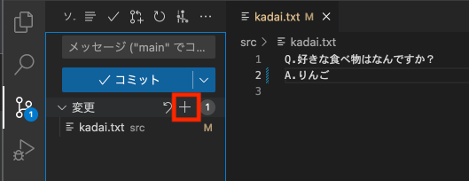
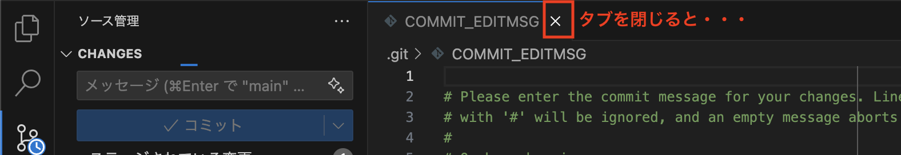
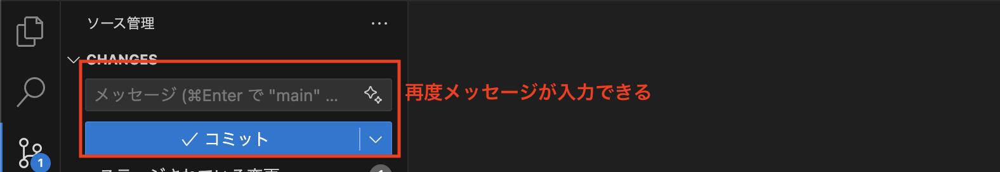
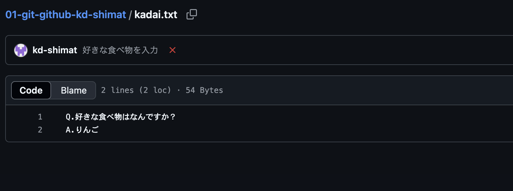

# GitHub Classroom②

本授業では、 **GitHub Classroom** を利用して課題の提出を行います。
課題の提出方法を以下に示しますので、手順に従って提出してください。

## ファイルの変更をステージングエリアに追加(add)

{: style="width: 660px;height: auto;" }

1. 課題として提出するフォルダをVSCodeで開く<br>
   VSCodeのメニューから「ファイル->フォルダーを開く」を選択し、`C:¥web_app_dev¥01-git...`を選択してください。
2. `kadai.txt`を開き、「A.」の横に好きな食べ物を入力し、保存する
   ※他にもファイルやフォルダがたくさんありますが、今回は`kadai.txt`のみを編集します。他は無視してください。
3. VSCodeサイドバーのGit Graphのアイコン{: style="width: 30px;height: auto;" }をクリック
4. 変更の欄に`kadai.txt`が表示されていることを確認し、+ボタンをクリック<br>
{: style="width: 660px;height: auto;" }
1. `kadai.txt`が「ステージされている変更に」移動していれば、addは成功
   {: style="width: 660px;height: auto;" }

## ファイルの変更をコミット(commit)

{: style="width: 660px;height: auto;" }

commitを行うためには、メッセージを入力する必要があります。
最初に変更理由の記録からはじめます。

1. メッセージの欄に変更理由を入力<br>
   ここでは「好きな食べ物を入力」とします。<br>
    {: style="width: 660px;height: auto;" }

1. ✔のボタンを押すとcommitは完了です。

```note
### commitのメッセージを入力し忘れると...

commitメッセージを入れ忘れると、commitができず、「COMMIT_EDITMSG」というファイルが開かれます。
解決するには、「COMMIT_EDITMSG」を閉じると再度commitメッセージを入力することができるようにります。

{: style="width: 660px;height: auto;" }
{: style="width: 660px;height: auto;" }
```

## GitHub Classroomに提出(push)

{: style="width: 660px;height: auto;" }

あとは課題を提出するのみです。

1. 変更の同期ボタンをクリック<br>
   {: style="width: 660px;height: auto;" }
2. [GitHub Classroomのリンク](https://classroom.github.com/a/bPW2aS9n)にアクセスし、編集内容が反映されていればOK<br>
{: style="width: 660px;height: auto;" }
1. kadai.txtを押して、中身が変わっていればOK<br>
   ※現時点で画面上部の「❌」は無視して大丈夫です。<br> 
{: style="width: 660px;height: auto;" }
1. 提出完了<br>
   今後の課題は、このようにGitHub Classroomに提出してもらいます。
